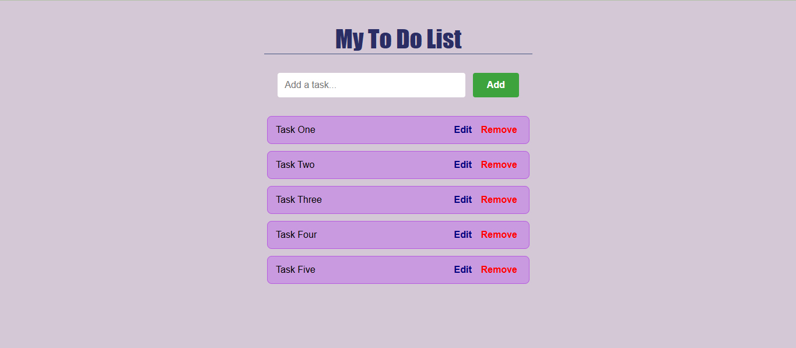

# To-Do List
A simple To-Do List web application built with HTML, CSS, and JavaScript. This application allows users to:
- Add tasks to the list.
- Edit tasks.
- Remove tasks from the list.

## Features
- User-friendly interface
- Responsive design

## Screenshots
Here is how the To-Do List looks:

## How to Use
1. Clone the repository:
   https://github.com/MahishaP/To-Do-List.git
2. Open `index.html` in your browser to view the application.

## Technologies Used
- HTML
- CSS
- JavaScript
